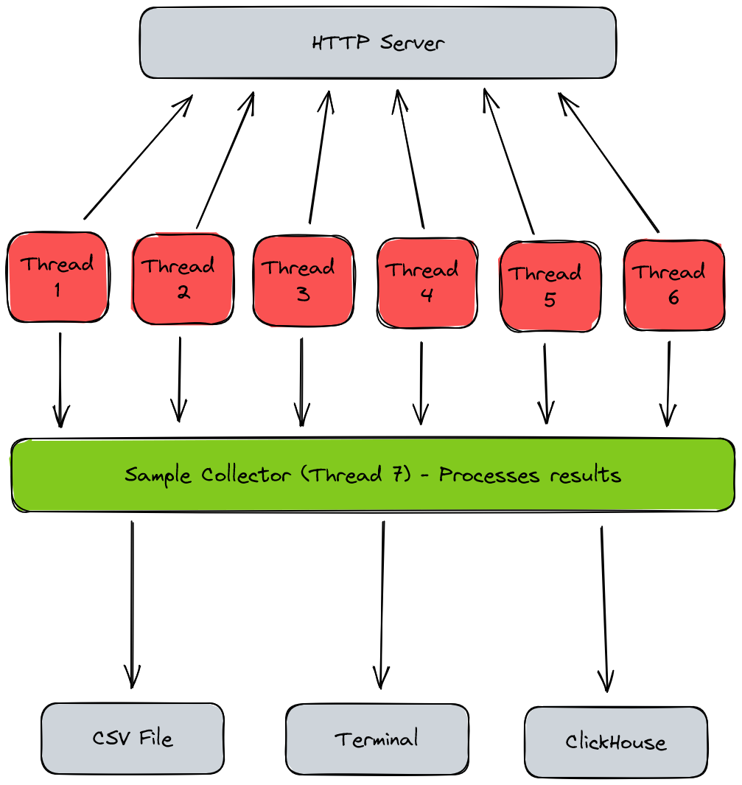

# ReWrk Core

This is the core benchmarker and runtime manager for ReWrk, the CLI tool is just a wrapper around 
this with some additional utilities.

The core design is as such:

- Several threads are assigned to send HTTP requests to the target server.
- Each thread is a separate runtime isolated from others
- Samples are collected per-runtime and dispatched to collectors every (n) seconds (provided by config)
- Collectors are able to process the submitted samples and export them to other forms (csv, etc...)

